# ECE 140A - Lab 3

### Karen Hernandez 
### PID: A16118872

### Winter Quarter 2022 
January, 26th, 2022

# Tutorials

## Tutorial 1 - Numpy
This tutorial is to teach us some principles of the numpy library and some of its methods. This is one of the most important python libraries for array/vector/image processing. 

Python file:
> **./Tutorials/tutorial_numpy.py**

## Tutorial 2 - OpenCV Basics 
OpenCV is a great library for performing image processing algorithms, and given it's base structure these processes 

Python file:
> **./Tutorials/tutorial_opencv.py**

### Grayscale Image
Reading the image as grayscale (1 dimension rather  tha 3-channel BGR). OpenCV default for reading an image in grayscale is by adding an argument "0" after the path of image to read: 

> e.g. *img = cv2.imread('img_path.jpg, 0 )*

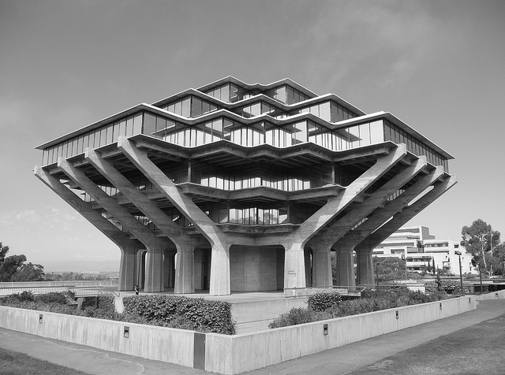

### Sobel Operator 
Changing the ksize modifies the shape/thickness of the edges computed in the image.
OpenCV's function to generate the Sobel Operator is as follow:
> sobelx = cv2.Sobel(src=img1, depth=cv2.CV_64F, dx=1, dy=0, ksize=5)

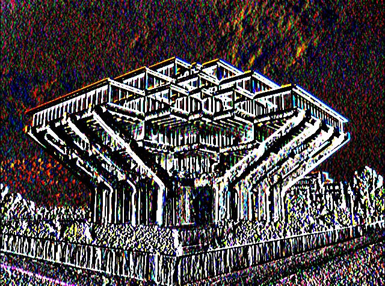

### Canny Edge Detector 
OpenCV also has a function for edge detector, which does several intermediate steps such as smoothing, thresholding, etc. The output by running this full function is a grayscale image with the edges calculated and filtered by a given threshold. 
> edge_canny = cv2.Canny(img1, 100, 200)

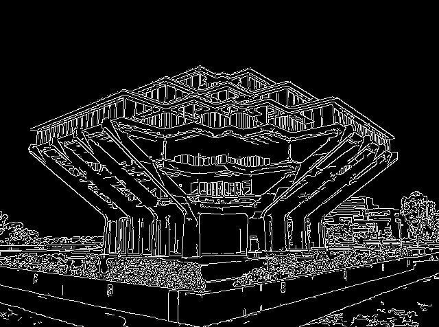   

### Question 1 
Inverting the values in the Blue channel. OpenCV by defaul reads the image as BGR, rather than the standard RGB order, thus we simply invert the first channel. Note that pixel values range from 0 - 255, 255 being the brightest value. 

> Blue_channel = 255 - Blue_channel

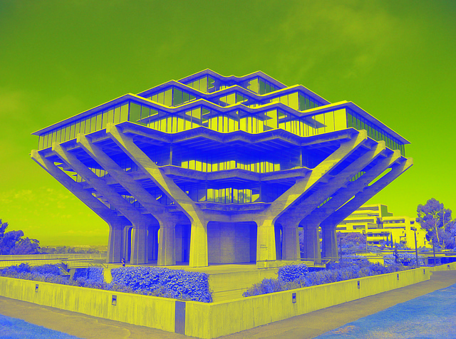

### Question 2
Using OpenCV’s *cv2.resize* command to resize the original image to half the original height and the same original width.
Assuming the image has been read with openCV or converted to numpy from PIL object, then we do the following:

> resized = cv2.resize(img, (img.shape[0], int(img.shape[1]/2)))

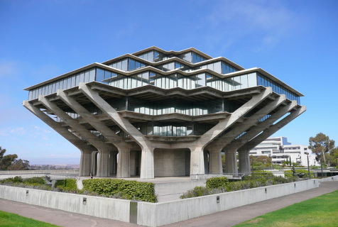

## Tutorial 3 - Your own Web Server

This tutorial was to teach us how to make a local server and host a web page, using *pyramid* python api wich is a Web Development Framework. 
Our local server displayed at the URL: 
> http://localhost:6543 

1. We generated a version of our web server that displayed a simple string, *'Hello World!*

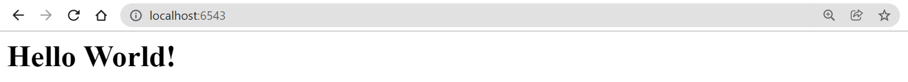

2. To challenge our knowledge a bit more, we added an image and a hyperlink to a Wikipedia page containing information about our image, in particular *Geisel Library*. This was accomplished by adding a new directory which contains our target image and a new version of the server python file that passes in our *index.html*. The HTML file is passed in to our *app1.py* Pyramid file and in that manner our website is able to link to the Wikipedia information and display the Geisel image. 

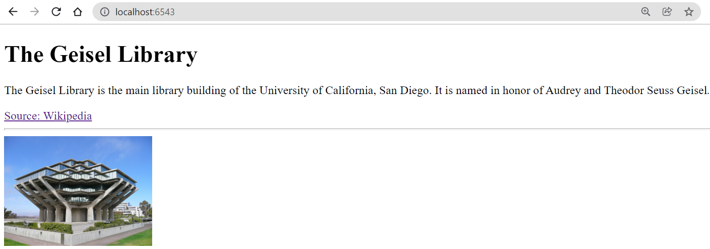

## Tutorial 4 - REST Server

### HTML Questions

#### What are the extra attributes mentioned in this tag?

*input type=number value="1" max="5" min="1" id="textInput"*

* The first input (“textInput”) will allow you to select values.
* Type is the type of object that will be displayed to click on. 
* Value is the default entry number
* Max/Min are the inclusive boundaries from 1  - 5 (hence 5 images)

In this tutorial we learned how to make our own REST structure, which are routes written in python, and then merging that with our html and javascript to include dynamic and interactive functionalities. This type of structures might be easier for tasks like web scrapping, as our information is divided by named routes.

**Sample output**
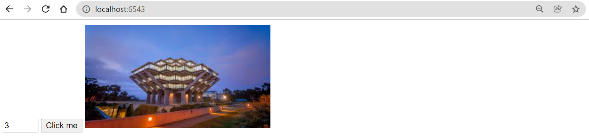

# Challenges

## Challenge 1 - My local portfolio

Building from the HTML portafolio we design for Lab 1, we served a web page using Pyramid framework. The goal is to generate 2 routes, one pointing to our main *index.html* and an added route /music/
> home: http://localhost:6543/ 

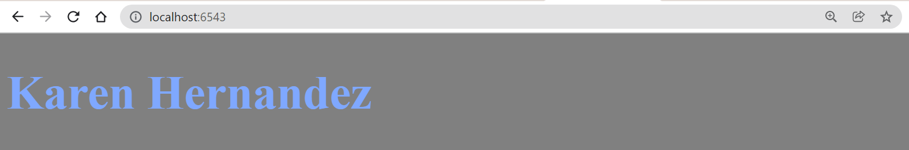

> home/music: http://localhost:6543/music/

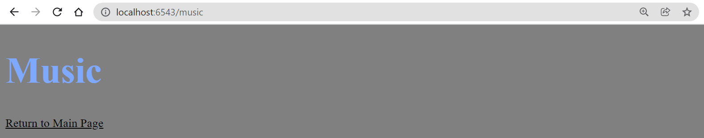

## Challenge 2 - The Triton Gallery

Similar to tutorial 4, designed a web server using Pyramid and a REST paradigm for the task of selling pictures of the Geisel library but this time we will also be displaying a price for each picture. With our knowledge from tutorial 4, we modified fuctions to calculate the price and an extra button to display both the price and image for 5 different options. Routes were added for photos and price using REST. 

### The WebServer output when accessing the URL initially

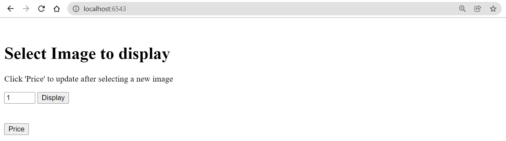

### The WebServer output when accessing the URL initially

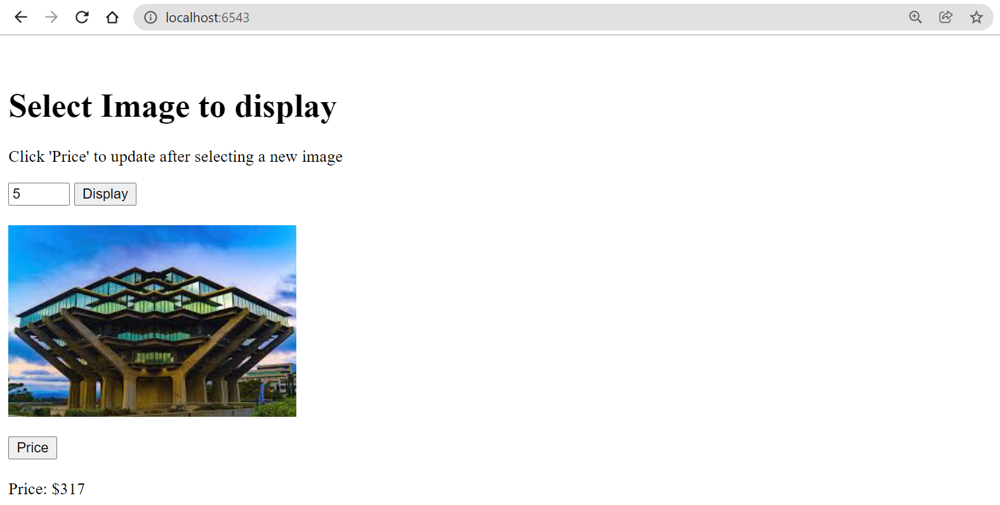

