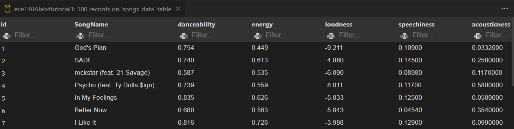
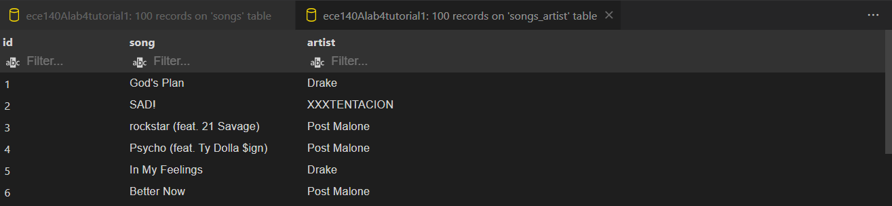
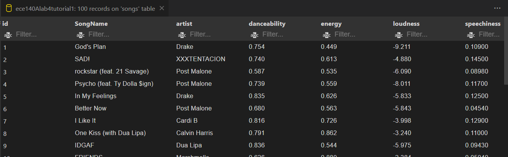

# ECE 140A

### Karen Hernandez 
### PID: A16118872

### Winter Quarter 2022 
January, 26th, 2022

# Tutorials

## Tutorial 1 - Installing MySQL

Intrusctions for installing MySQL, a lenguage for data managementand. 
Introduction to what MySQL is used, basic methods for generating a database (similar to an excel file containing attributes(columns) and id's corresponding to each element ( row)). 

For our first basic dataset genereted the following *'.sql'* files were created:

*~/Tutorials/Tutorial_1/*

After creating our *Tutorial1* dataset, we **created** our table, whith the attributes to be used in the table (column titles) and the id (index) of the table. Refer to: 
> *create.sql*

Inserting row inputs to the blank table created. 
> *insert.sql*

We can select sections of the table that correspondong to specific attributes, primary keys, etc. In the example we simply select all the table to be displayed.
> *select.sql* 

Updating an existing row in the current table. 
> *update.sql*

Deleting a row from the table, then by calling the select file we could see the row called to be deleted no longer present on the dataset's table. 
> *delete.sql*

## Tutorial 2 - Creating Tables from CSV 

### SQL Data Types 

For most basic tables we use the most common data types:

* VARIABLE: A string which takes maximum length as that of the input argument *'variable(size)'* or up to 65,6535 characters. 

* INTEGER: Equivalent to INT(size) which is a medium-length integer

* DECIMAL: Takes as input arguments (size, d)

    * Size: It can have up to size-number of digits up to the decimal point

    * d: The maximum number of decimals to include (it will round up to the max value if decimal points are longer than d)

On a **new dataset** named *Lab4_songs*

#### Created tables from two csv files using SQL only

> Song data 'csv' to SQL table

> Song artist 'csv' to SQL table

#### Merged tables

Then, a third table was generated as the ouput of merging both tables by their 'id'. Finally, after visualizing that the data was merged correctly, we moved one of the columns to be read in as the second attribute rather than the last. 

> Final table with merged data from both input *csv* files

## Tutorial 3 - Introduction to Queries with SQL

MySQL is design such that users can query data from the dataset's tables, meaning that requests are sent to MySQL database to obtain data or modify the table. 

### Sample quieries

* Selecting specific columns

> SELECT col_1_attribute, col_2_attribute FROM table_name ;

* Selecting distinct entries (rows) from a specified column

> SELECT DISTINCT col_n_attribute FROM table_name ;

* Selecting data based on conditions

> SELECT * FROM table_name WHERE col_1_attribute > some_value AND col_2_attributes != 'some name in that col';

* Ordering data based on columns, this cann be in ascending/descending order or by another condition 

SELECT * FROM table_name WHERE col_n_attribute > 0.75 ORDER BY col_1_attribute ASC, col_2_attribute DESC;

### Data Aggregation and Grouping

Given that is tabular data, many time statistical measurements are of great use. MySQL have aggregating functions such as: 

* COUNT : This can count number all or distinct number of items in a column. The count can also be from GROUP (grouped) entries

* MAX, MIN

* AVG

### Nested queries

Given that SQL is a lenguage, similar to other programming lenguages you can perform nested queries - comparable to for-loops and/or if-statements.

# Challenges

## Challenge 1

Using SQL to implement 11 goals to obtain spefic data in a specifig order or format. Mainly used SELECT, COUNT, SUM, WHERE, GROUP BY. 

Files within:
> Challenges/Challenge_1/*.sql

## Challenge 2

On a newly created database called **Challenge 2**, generated new tables using 4 csv files. Then using knowledge from the tutorials and challenge 1 to retieve, modify and update the data as needed. 

In these part we just practiced more with different combinations and formats of query the database's tables. 
Joining tables, and modified was also implemented. 