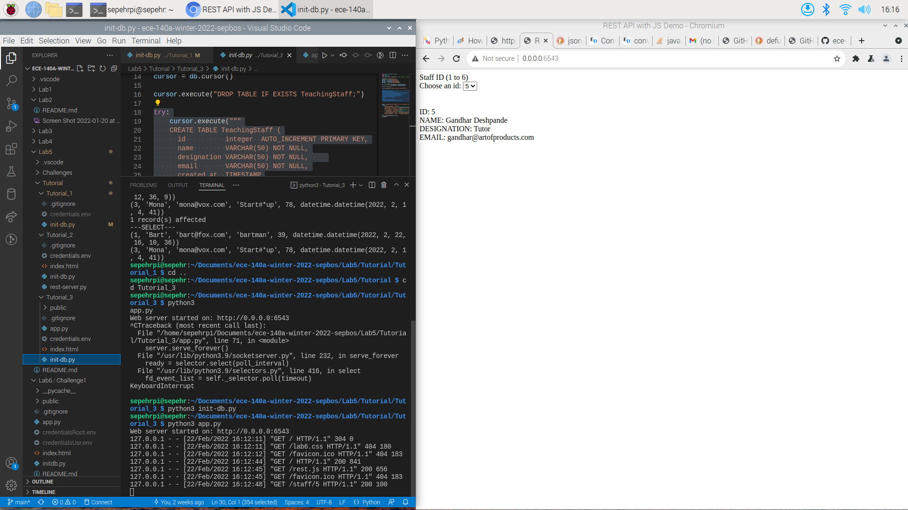

# ECE 140A - Lab 6 MIDTERM

**Winter Quarter 2022**

**Feb, 21th, 2022**
## Authors

### Sepehr Bostanb - PID: A16062097
### Karen Hernandez - PID: A16118872

# Tutorials

## Tutorial 1

The goal was to learn how to setup up a RaspberryPi, install the sd Card with proper user settings, and setp up the environment. In order to have easier access to develop within the RaspberryPi, we also enabled SSH with an updated OS system.
we also learned how to interact with the linux os interface and setup and run mysql using mariadbd. we redid tutorial 1 and 3 of lab 5 successfully and moved on to tutorial 2.

## Tutorial 2

After we setup the RaspberryPi in tutorial1, now we can add more hardware to implement basic input/output tasks. Using a python environment, we are able to communicate to the sensor we required to use for the challenge. 

#### Basic Motion Sensor
An ultrasonic sensor that measures distance of an object by using measurement of the time lap for a signal to return, sent by the sensor itself.
We used this sensor as the template to how implement a full python function and circuit connection bewteen the sensor, board any any other required components. In addition, wwe implemented a buzzer that would be enabled when a certain distance was measured by the ultraonic sensor.
Since the functions for the sensor and RaspberryPi are written in python, then we used the **GPIO library.
- *GPIO* : General-purpose input/output library.

### Important functions of GPIO

1. Setting up the program to match the pin values of the circuit and the breakout board. Note that the argument *GPIO.BCM* indicates to use the actual labels of the pins on the breakout board (printed values)

> GPIO.setmode(GPIO.BCM)

2. Similar as above, to set up the pins requires for the program but this is relative to numerical order of the pins. 

> GPIO.setmode(GPIO.BOARD)

3. finally, in order to release the memory and space that non-occupied pins are taking, we release them with the following:

> GPIO.cleanup()

# Challenges
## Midterm

The goal was to implement **two sensors** and record their reading onto a MySQL database with a python-connector. The database would then be accessed by our server in order to output desired readings with at least two different criterias to filter the data with. 

1. The two sensors chosen were the *ultrasonic sensor and a joystick*. The readings we wanted the obtain are distance and, and the x and y angles. These were chosen as we plan to possibly further implement these in future projects. We input the sonar distance reading along wiht x and y direction of the joystick and we save the timestamp of each reading per second.

2. RESTful routes were generated to obtain the desired data from the database, and the pass that onto the *javascript*. The intention was to create a more effective connection between our server page, the HTML file, our javascript, our database (generate, record, retrieve, etc.) and the RESTful API.

3. We had the choice to record the readings of the sensors live or pre-record them and use a saved *.csv* file that would be the data of our database. Note that this was explicitly said by the T.A. 

Our SQL database contained the following attributes (header names od the columns)
- id (in order of recordings)
- distance 
- x angle
- y angle 
- datatime created at 

We then retrieved the data by calling a SQL query. The options given to the client (or viewer of our web server):

- Filter by certain distance ranges
- Filter by x angle ranges
- Filter by y angle ranges. 

Then the webpage could output a table with the query selection output or a *json* file with the same data but intended to be downloaded or exported. 

4. Finally, we implemented an LED light on our hardware. Once it was part of our circuit, we added a toggle button within the webserver to turn it on or off. For future development we would make the button such that when it's on the database begins to save new/more measurements from the sensors and while displaying the LED on. When off the recording of measurements would stop and the LED would turn off. These is for the user to have some sort of interaction with the  hardware components and not just the  fully functional website. 

### Link to our challenge 1 - Midterm 

Link to the final result of our project.

['Challenge 1 Video'](https://www.youtube.com/watch?v=TH7R2q8ia1I)