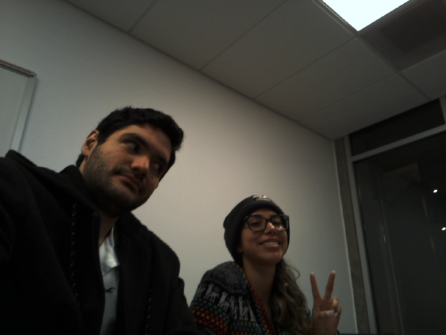
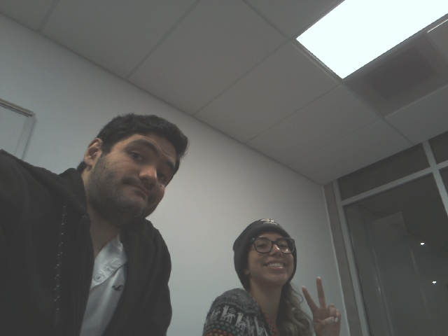
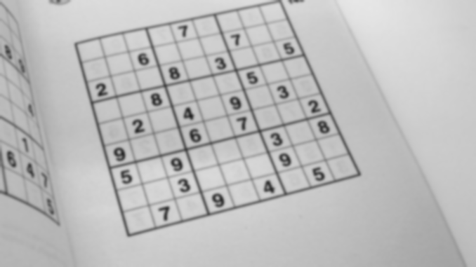
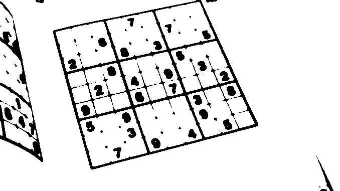
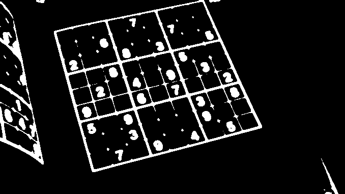
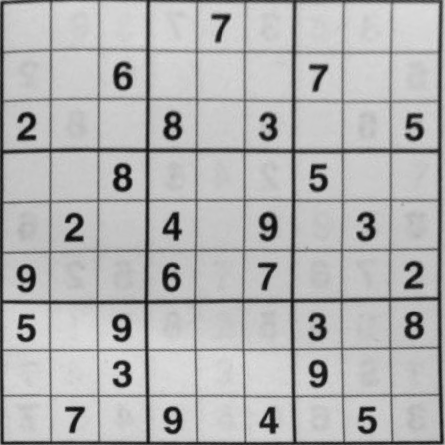
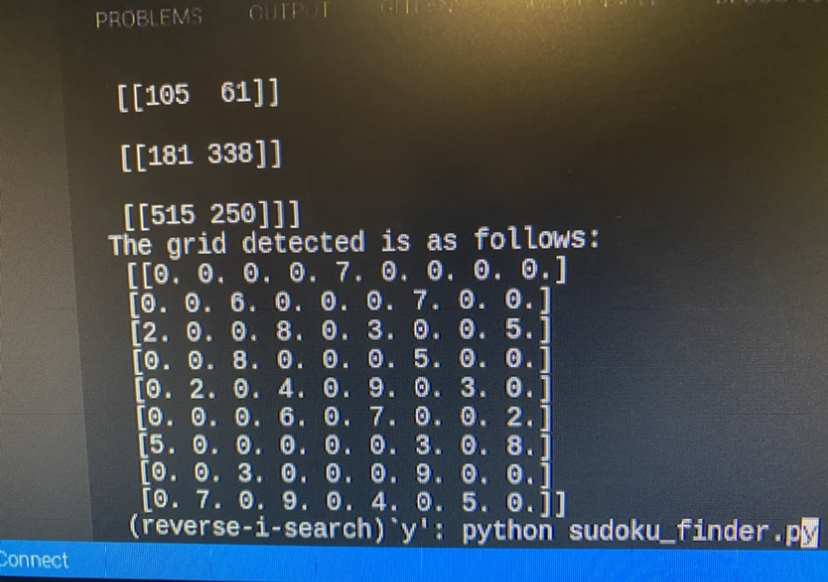

# ECE 140A - Lab 7

- **Winter 2022**

- ** March 1st, 2022**

## Partners

- **Karen Hernandez**

  - A16118872

- **Sepehr Bostan**
  - A16062097

# Tutorials

## Tutorial 1 - Say Cheese!

In this tutorial we first had to install open-cv, in order to be able to capture images using a camera which is connected to our RaspberryPi. The python library _opencv_ allows us to capture, save, display and edit media files, in particular images and videos.

### Our first WebCam capture

The image saved within:

> ~/Tutorials/Tutorial_1/test.png

**test.png**

#### Brightening the image

Since the contrast of our initial image was too high, we normalikzed the tones of our image with the following function:

> cv2.normalize(image, image, 50, 255, cv2.NORM_MINMAX)

## Tutorial 2 - Sudoku Extractor

This tutorial focus on image processing in order to obtain a cropped version of the image centered on the object of interest. We also learned how to extract text/numbers from an image using the **PyTesseract** object.

### Preprocessing raw input image

#### Gaussian Blur

> blur = cv2.GaussianBlur(img.copy(), (9, 9), 0)

**Blur Image output**

#### Binary Image

> thresh = cv2.threshold(blur, 0, 255, cv2.THRESH_BINARY | cv2.THRESH_OTSU)[1]

**Binary Image output**

#### Inverted image

> invert = 255 - thresh

**Inverted Image output**

#### Dilated Image

> kernel = np.array([[0., 1., 0.], [1., 1., 1.], [0., 1., 0.]], np.uint8)
> dilated = cv2.dilate(invert, kernel)

**Dilated Image output**

### Finding Contours and Polygons

After preprocessing the image, we find the shapes of group of pixels that have similar properties given a color or another attribute.

#### Result imgae

The image after finding the polygon and reshaping centering the sodoku to be the whole image

**Result Image**

#### Result after tesseract

Tesseract read the cropped image and using some for loops we showed the result from image to text created by tessaract in a sudoku formated text

# Challenges

## Challenge 1 - Number Plate Detector

We were to take in different images that contain car plates. we then applied some image processing to have a clean gray-scaled image. We do this by reading an image then smoothing(bluring) the image followed by grayscaling the image, then we threshold to have a black and white image. we then send the result of the image processing to detect the contours and find the quadrilateral shapes in it and we return the location of the four corners of the rectangular shape. We crop the image using the locations and we finally use the tesseract to extract the values on the plate. during all of this process we save the image names and tesseract results in a sql data base.
We created a rest webserver with a data-base to show the image, the image to text value of tesseract and the time they were entered in my sql depending on the numerical input from the user.

Challanges:

1. Some images required us to use TREE parameter hierarchy to find the countors and others required external parameter.
2. Images required differnt way of image processing for example the Arizona and Contrast used defult given processing in tutorial 2 however for the Delaware plate we used an adaptive binary thresholding with gaussian bluring.
3. First two images required to be cropped but the Delaware didn;t needed to be cropped and the image could just be use in tesearact.
4. for Arizona_47 and Contrast images we used all letters and numbers to be extracted however since Delaware had state name and some other values in there we had to white list only the numbers and only read the first 8 entry of the tesearact result to get the plate numbers only

